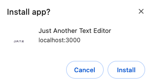
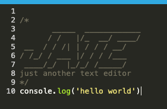
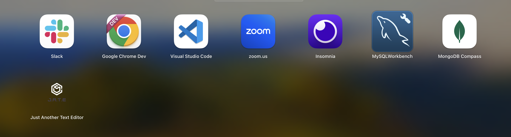
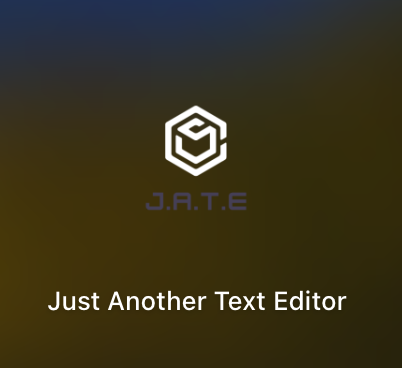
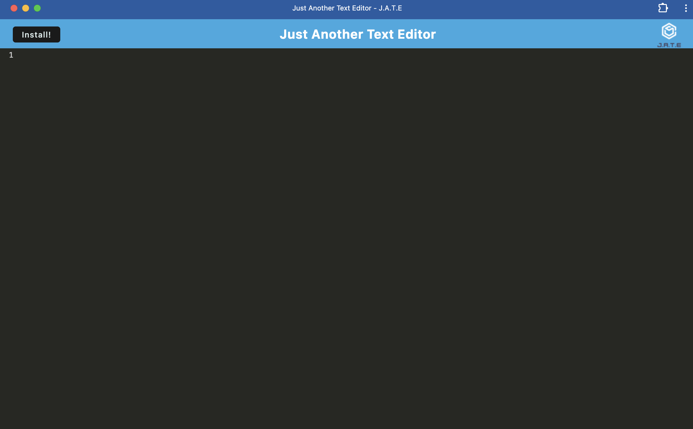

# Super-Telegram

## Description

This project produced a Progressive Web App `PWA` that allows users to create notes or code snippets with JavaScript syntax highlighting, with or without an internet connection and can reliably retrieve them for later use.
By completing this project I was able to demonstrate `PWA` principals I learned in bootcamp coding class.

## Table of Contents

- [Installation](#Installation)
- [Useage](#Useage)
- [Credits](#Credits)
- [License](#License)
- [Questions](#Questions)

## Installation

Run the following commands in your integrated terminal to start the application locally.
"npm install"
"npm start"

OR

Visit the deployed Render site at:

https://super-telegram.onrender.com

To install the application, click on the "install" button at the top left of the screen and follow the prompt commands.

Click "install"

## Useage

Use the editor as you would any other text editor, create notes or code snippets with JavaScript syntax highlighting - it will save your progress everytime you use it.

To use this app offline, you will need to install the app.

Click "install"

Visit the launchpad that allows you to run applications on your computer.

Here you will find the newly installed application.

From here, you will no longer need a internet connection to run the application and save your progress.

## Credits

Thank you to my bootcamp instructors, Roger and Sasha for the instruction that allowed me to build my app.

## License

MIT License

## Questions

https://github.com/coulterkyle

For questions regarding this app, contact me at:

e-mail: kcoulter2002@gmail.com